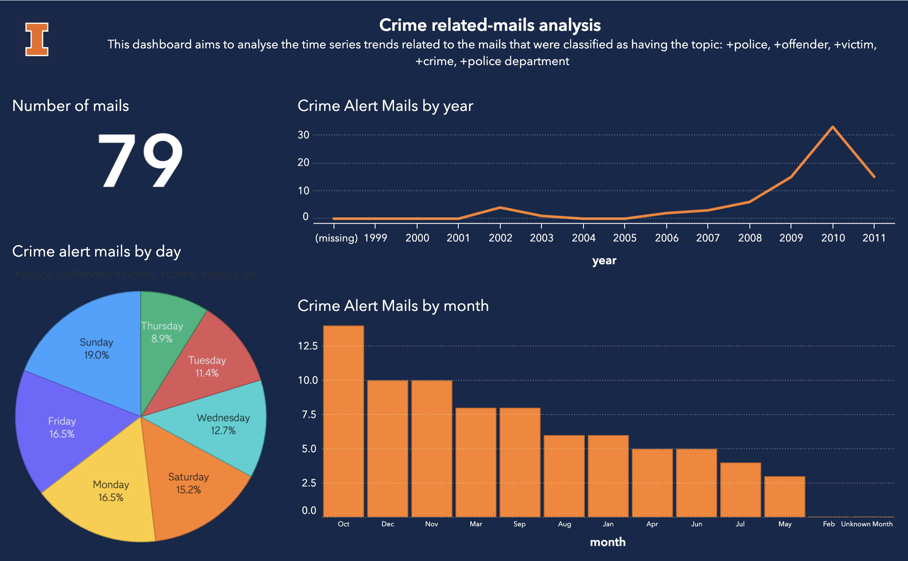

<div align="center">


<h2 align="center">Emails that matter: Insights from UIUC Mail Archives Using <a href="https://www.sas.com/en_us/software/viya-for-learners.html" target="_blank">SAS Viya</a></h2>

<h4>This project aims to analyze and uncover trends within historical university emails distributed through the CITES Massmail system between October 22, 1999 to November 20, 2011.</h4>

## How To Use

```bash
# Clone this repository
$ git clone https://github.com/anushavc/uiuc_mail_analysis.git

# Install the requirements
$ pip install -r requirements.txt

# Run the massmail_scraper.py for scraping the mails
$ python massmail_scraper.py

# Run the mail_preprocessing.py for processing the scraped mail records
$ python mail_preprocessing.py
```
## SAS Visual Analytics Dashboard 



## Medium Article...
For an in-depth explanantion of the project, head on over to my medium: 

[Part 1: Explaining the scraping and pre-processing process](https://anushavc.medium.com/emails-that-matter-insights-from-uiuc-mail-archives-using-sas-viya-part-1-78ae5a26623f) <br></br>
[Part 2: Explaining the Text analytics pipeline and dashboard](https://anushavc.medium.com/emails-that-matter-insights-from-uiuc-mail-archives-using-sas-viya-part-2-71be5adee4c5)

## You may also like...

[Tableau Dashboarding with GIS Data](https://github.com/anushavc/trafficsignschampaign)

